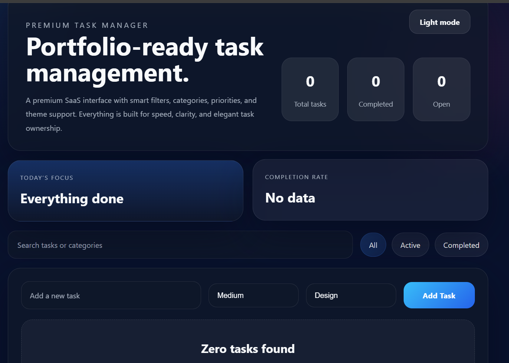

# 🚀 Premium Todo App

A modern and portfolio-ready Todo Application built using React and Vite.

## 🌐 Live Demo

https://todo-app-six-chi-15.vercel.app/

## ✨ Features

- Add new tasks
- Delete tasks
- Mark tasks as completed
- Track total, completed, and pending tasks
- Modern SaaS-inspired UI
- Responsive design
- Light/Dark mode support
- Fast performance with React + Vite

## 🛠️ Tech Stack

- React.js
- Vite
- JavaScript (ES6+)
- CSS3
- Git & GitHub
- Vercel

## 📸 Preview



## 📂 Project Structure

```text
todo-app/
├── public/
├── src/
│   ├── assets/
│   ├── App.jsx
│   ├── App.css
│   ├── main.jsx
│   └── index.css
├── package.json
├── vite.config.js
└── README.md
```

## 🎯 Learning Outcomes

- React Components
- State Management using Hooks
- Event Handling
- Responsive UI Design
- Git & GitHub Workflow
- Vercel Deployment

## 👨‍💻 Author

**Vikas Singh**

- GitHub: https://github.com/Iceyvik

---

⭐ If you like this project, consider giving it a star on GitHub.
